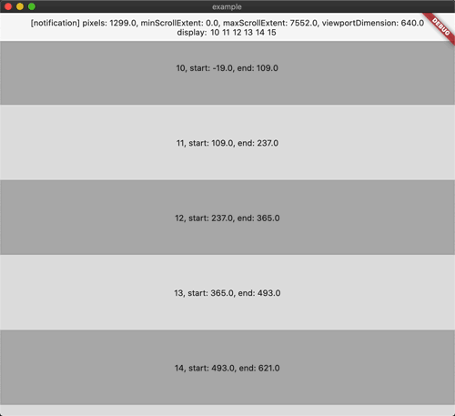
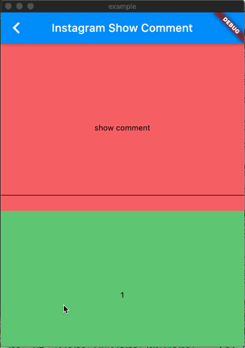

# widgets_visibility_provider

[](https://pub.dartlang.org/packages/widgets_visibility_provider)
[](https://996.icu)
[]()
[](https://opensource.org/licenses/MIT)

A library that listens to children inside `scrollview`

一个监听 `scrollview` 内部 child 的库



like Instagram show comment



## Getting Started

```yaml
widgets_visibility_provider: ^2.0.1
```

## More info

[Flutter 如何在 scrollview 监听子 widget](https://yeungkc.com/flutter-how-to-listen-children-inside-scrollview/)

[Flutter 实现类似 ins 的显示评论框效果](https://yeungkc.com/widgets_visibility_provider_ins_screenshot/)

## How to use

如何使用

### First

Use `WidgetsVisibilityProvider` to wrap `scrollview`(`CustomScrollView`, `ListView`...)

使用 `WidgetsVisibilityProvider` 包裹 `scrollview`(`CustomScrollview`, `ListView`..)

```dart
WidgetsVisibilityProvider(
  // range condition default or return null condition is:
  // 范围判断默认或者返回 null 情况下执行的是：
  // positionData.endPosition >= 0 && positionData.startPosition <= positionData.viewportSize
  condition: (PositionData positionData)=> null,
  // No need to wrap directly
  // 不必直接包裹
  child: SomeWidget(
    child:  ListView.builder(// CustomScrollView, GridView...
      ...some code...
    ),
  ),
)
```

### Second

Use `VisibleNotifierWidget` to wrap child widget

使用 `VisibleNotifierWidget` 包裹子 widget

on `ListView`:

```dart
ListView.builder(
  itemCount: itemCount,
  itemBuilder: (context, index) => VisibleNotifierWidget(
    // data type is dynamic, you can set everything or don't set or null
    // data 的类型是 dynamic, 你可以设置任何数据或者为 null 或者不设置
    data: index,
    // you can use builder or child
    // 你可以使用 builder 或者 child
    // positionData and notification is nullable
    // positionData 和 notification 有可能为空
    builder: (context, notification, positionData) => ...,
    // if you use builder, can't use listener and child
    // 如果你使用了 builder, 就不能使用 listener 和 child
    listener: (context, notification, positionData) {
      ...
    },
    child: child(),
    // default buildWhen or return null condition is:
    // 默认判断或者返回 null 情况下执行的是:
    // if (previousPositionData != currentPositionData) return true;
    // if (previousPositionData != null && currentPositionData != null)
    // return previousNotification != currentNotification;
    // return false;
    condition: (
      previousNotification,
     previousPositionData,
     currentNotification,
     currentPositionData,
     )=>...,
  ),
)
```

on `SliverToBoxAdapter`

```dart
SliverToBoxAdapter(
  child: VisibleNotifierWidget(
    // same to ListView example
    // 和上面一样
    ...
    child: child,
  ),
)
```

on `SliverList`

```dart
SliverList(
  delegate: SliverChildBuilderDelegate(
    (BuildContext context, int index) => VisibleNotifierWidget(
      // same to ListView example
      // 和上面一样
      ...
      child: child,
    ),
  ),
)
```

### Maybe Third

If you want to watch all widget information

如果你希望一次过获取所有范围内的 widget 信息

Use `WidgetsVisibilityBuilder` or `WidgetsVisibilityListener` or `WidgetsVisibilityConsumer` in `WidgetsVisibilityProvider` childtree
If you use bloc, you can also use `WidgetsVisibilityProviderBloc`

在 `WidgetsVisibilityProvider` 的子 widget 使用 `WidgetsVisibilityBuilder` 或者 `WidgetsVisibilityListener`或者`WidgetsVisibilityConsumer`
如果你使用 bloc，也可以使用 `WidgetsVisibilityProviderBloc`

```dart
WidgetsVisibilityBuilder(
  builder: (context, event) => someWidget,
  // Of course, you can also increase the judgment buildWhen
  // 当然你也可以增加条件
  buildWhen: (previous, current)=>...,
)

WidgetsVisibilityListener(
  // Of course, you can also increase the judgment listenWhen
  // 当然你也可以增加条件
  listenWhen: (previous, current)=>...,
  listener: (context, event) {
    ...
  },
  child: child,
)

WidgetsVisibilityConsumer(
  builder: (context, event) => someWidget,
  buildWhen: (previous, current)=>...,
  listenWhen: (previous, current)=>...,
  listener: (context, event) {
)
```

#### About data bean

`PositionData`

```dart
class PositionData extends Equatable {
  final double startPosition;
  final double endPosition;
  final double viewportSize;
  final dynamic data;

  ...other code
}
```

`WidgetsVisibilityEvent`

```dart
class WidgetsVisibilityEvent extends Equatable {
  final ScrollNotification notification;
  final List<PositionData> positionDataList;

  ...other code
}
```
